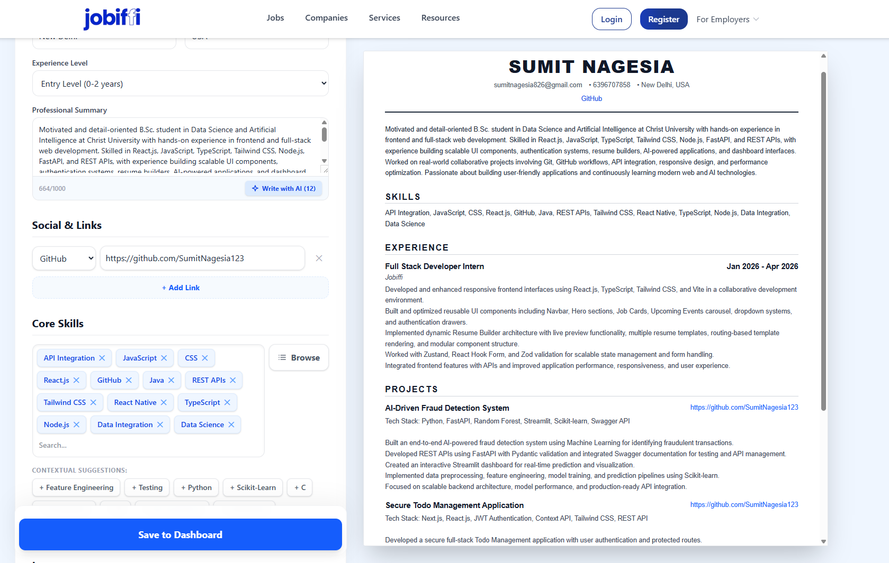

# Jobiffi — Full Stack Engineering Showcase

## Project Overview

Jobiffi is a scalable career and job platform focused on responsive frontend systems, modular architecture, reusable UI components, backend workflow design, and user-focused engineering.

This repository is a professional showcase of my engineering contributions, architectural thinking, frontend systems, backend workflow understanding, and collaborative development experience related to the Jobiffi platform.

---

# Showcase Areas

- Frontend Architecture
- Responsive UI Systems
- Interactive Components
- Resume Feature Workflows
- State Management
- Backend Workflow Understanding
- API Architecture Concepts
- Authentication Flow Design
- Scalability Thinking
- Git Collaboration Workflow

---

# My Contributions

## Frontend Engineering
- Responsive frontend architecture
- Interactive carousel systems
- Resume feature frontend workflows
- Navigation and dropdown improvements
- Reusable UI component structures
- Responsive layout fixes
- Frontend debugging and optimization
- Zustand state management integration

## Backend Understanding
- API workflow understanding
- Authentication flow concepts
- Database architecture understanding
- Modular backend scalability concepts
- Secure route workflow understanding

## Collaboration Workflow
- Git branching workflows
- Pull request collaboration
- Merge conflict resolution
- Team-based frontend development

---

# Repository Structure

/frontend → Frontend systems and UI showcase

/backend → Backend architecture understanding and workflows

/architecture → Architecture diagrams and engineering structure

/screenshots → UI screenshots and responsive showcase

---

# Contribution Disclaimer

This repository is a personal engineering showcase related to the collaborative Jobiffi platform project.

The original platform was developed collaboratively. This showcase highlights the areas I personally contributed to and the engineering systems I worked with, including frontend architecture, responsive UI systems, interaction workflows, reusable components, and backend architectural understanding.

---

# Future AI Ideas

- AI-powered job recommendations
- ATS-based resume analysis
- AI-generated career suggestions
- Smart dashboard insights
- AI-assisted resume optimization

---

# Technologies

- React
- TypeScript
- Tailwind CSS
- Zustand
- Node.js
- Express.js

- # UI Showcase

## Homepage

## Responsive Navbar

## Mobile UI

## Carousel System

- MongoDB
- Framer Motion
- Git & GitHub
